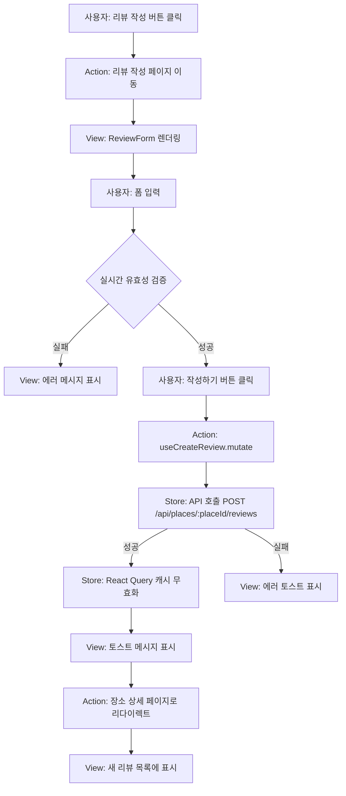
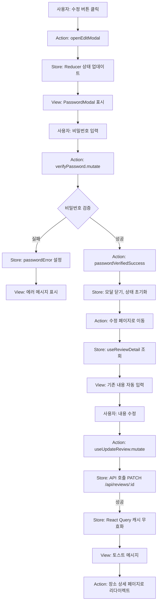
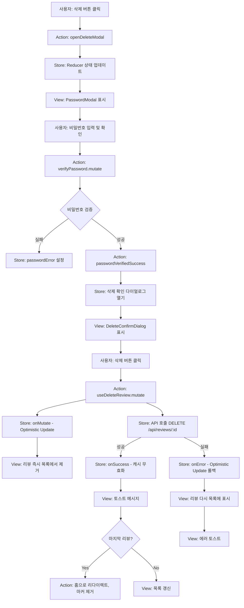
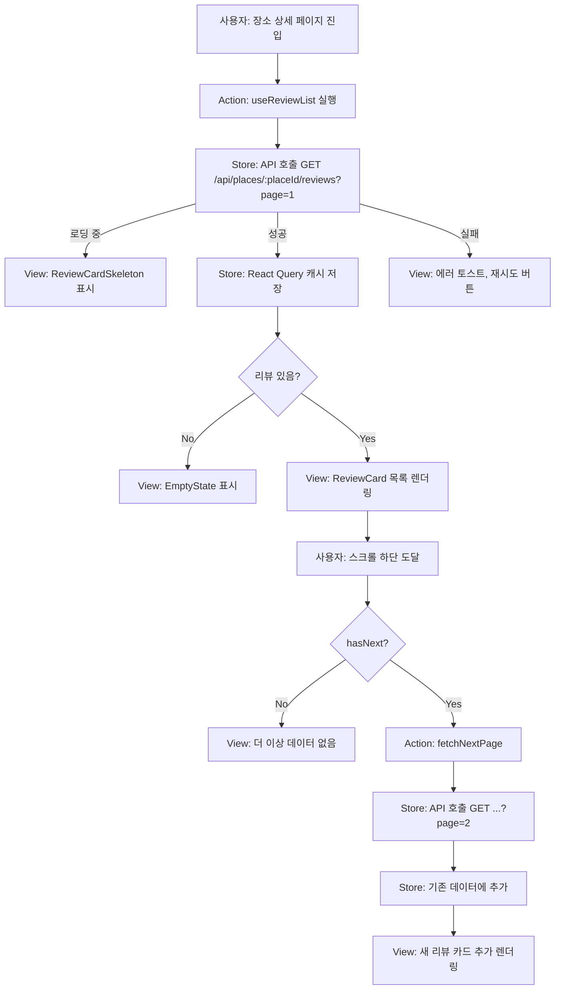

# 리뷰 관리 페이지 - 상태 관리 설계 문서

## 문서 정보

- **버전**: 1.0.0
- **최종 수정일**: 2025-10-22
- **작성자**: Development Team
- **문서 상태**: Draft
- **참조 문서**:
  - [PRD - 리뷰 관리 기능](/docs/prd.md#323-리뷰-관리)
  - [사용자 플로우](/docs/userflow.md#3-리뷰-작성-페이지-placeplaceidsreviewnew)
  - [유스케이스 - 리뷰 관리](/docs/usecases/review-management.md)
  - [공통 모듈](/docs/common-modules.md)

---

## 개요

이 문서는 리뷰 관리 기능(작성, 조회, 수정, 삭제)의 상태 관리 설계를 정의합니다. Context + useReducer 패턴과 React Query를 조합하여 클라이언트 상태와 서버 상태를 명확히 분리합니다.

### 설계 원칙

- **Context + useReducer**: 폼 상태 및 UI 상태 관리
- **React Query**: 서버 상태 관리 (리뷰 데이터 CRUD)
- **react-hook-form**: 폼 입력 및 유효성 검증
- **상태 분리**: 클라이언트 상태(폼, 모달)와 서버 상태(리뷰 데이터)를 명확히 구분
- **비로그인 환경**: 사용자 인증 상태 관리 불필요

---

## 1. 관리해야 할 상태 목록

### 1.1 클라이언트 상태 (Context + useReducer)

| 상태 이름 | 타입 | 설명 | 초기값 |
|----------|------|------|--------|
| `passwordModalOpen` | boolean | 비밀번호 확인 모달 열림 상태 | false |
| `passwordModalType` | 'edit' \| 'delete' \| null | 비밀번호 모달의 목적 | null |
| `targetReviewId` | string \| null | 수정/삭제 대상 리뷰 ID | null |
| `deleteConfirmOpen` | boolean | 삭제 확인 다이얼로그 열림 상태 | false |
| `reviewSortOption` | 'latest' \| 'rating' | 리뷰 정렬 기준 | 'latest' |
| `passwordVerificationLoading` | boolean | 비밀번호 검증 중 로딩 상태 | false |
| `passwordError` | string \| null | 비밀번호 검증 에러 메시지 | null |

### 1.2 폼 상태 (react-hook-form)

#### 리뷰 작성/수정 폼

| 필드 이름 | 타입 | 검증 규칙 | 기본값 |
|----------|------|----------|--------|
| `authorName` | string | 2-10자 | '' |
| `rating` | number | 1-5 (정수) | 0 |
| `content` | string | 10-500자 | '' |
| `visitedAt` | string \| undefined | 유효한 날짜 (선택) | undefined |
| `password` | string | 4-20자 | '' |

#### 비밀번호 확인 폼

| 필드 이름 | 타입 | 검증 규칙 | 기본값 |
|----------|------|----------|--------|
| `password` | string | 4-20자 | '' |

### 1.3 서버 상태 (React Query)

| 쿼리/뮤테이션 | 키 | 설명 | 캐싱 전략 |
|--------------|-----|------|----------|
| `useReviewList` | `['reviews', 'list', placeId, params]` | 장소별 리뷰 목록 조회 | staleTime: 5분, 무한 스크롤 |
| `useReviewDetail` | `['reviews', 'detail', reviewId]` | 리뷰 상세 조회 (수정 시) | staleTime: 5분 |
| `useCreateReview` | - | 리뷰 작성 뮤테이션 | 성공 시 목록 무효화 |
| `useUpdateReview` | - | 리뷰 수정 뮤테이션 | 성공 시 목록 무효화 |
| `useDeleteReview` | - | 리뷰 삭제 뮤테이션 | Optimistic Update + 목록 무효화 |
| `useVerifyPassword` | - | 비밀번호 검증 뮤테이션 | 캐싱 없음 |

### 1.4 화면상 데이터지만 상태가 아닌 것

| 데이터 | 출처 | 설명 |
|--------|------|------|
| 장소 정보 (이름, 주소) | `usePlace(placeId)` | 리뷰 작성/수정 페이지 헤더 표시, 별도 Query로 관리 |
| 상대 시간 표시 ("2일 전") | `formatRelativeTime(createdAt)` | 유틸리티 함수로 계산, 상태 아님 |
| 평균 평점, 리뷰 수 | 장소 정보에 포함 | 서버에서 집계된 값, 별도 상태 아님 |
| 현재 페이지 번호 | React Query의 `pageParam` | 무한 스크롤 내부 상태 |

---

## 2. 상태 변경 조건 및 화면 영향

### 2.1 클라이언트 상태 변경

| 상태 | 변경 조건 | 화면 변화 |
|------|----------|----------|
| `passwordModalOpen: true` | 수정/삭제 버튼 클릭 | 비밀번호 입력 모달 표시 |
| `passwordModalOpen: false` | 모달 취소/확인 완료/ESC | 모달 숨김 |
| `passwordModalType: 'edit'` | 수정 버튼 클릭 | 모달 제목 "리뷰 수정" 표시 |
| `passwordModalType: 'delete'` | 삭제 버튼 클릭 | 모달 제목 "리뷰 삭제" 표시 |
| `targetReviewId: string` | 수정/삭제 버튼 클릭 | 대상 리뷰 ID 저장 (검증 후 사용) |
| `deleteConfirmOpen: true` | 비밀번호 검증 성공 (삭제 시) | 삭제 확인 다이얼로그 표시 |
| `deleteConfirmOpen: false` | 다이얼로그 취소/확인 완료 | 다이얼로그 숨김 |
| `reviewSortOption: 'rating'` | 정렬 드롭다운에서 "평점순" 선택 | 리뷰 목록 재조회, 평점 높은 순 정렬 |
| `passwordVerificationLoading: true` | 비밀번호 검증 API 호출 시작 | 확인 버튼 비활성화, 로딩 스피너 표시 |
| `passwordError: "비밀번호가 일치하지 않습니다"` | 비밀번호 검증 실패 | 에러 메시지 표시, 필드 빨간 테두리 |

### 2.2 폼 상태 변경

| 필드 | 변경 조건 | 화면 변화 |
|------|----------|----------|
| `rating: 5` | 별점 5번째 클릭 | 5개의 별 모두 채워짐 |
| `content: "..."` (10자 미만) | 사용자 입력, blur 이벤트 | 필드 하단에 "최소 10자 이상 입력해주세요" 에러 표시 |
| `content: "..."` (10자 이상) | 사용자 입력, blur 이벤트 | 에러 메시지 제거, 필드 녹색 테두리 (선택사항) |
| `password: "1234"` | 사용자 입력 | 마스킹된 점(••••) 표시 |
| `visitedAt: "2025-10-15"` | 날짜 선택기에서 날짜 선택 | 선택된 날짜 표시 |

### 2.3 서버 상태 변경

| 쿼리/뮤테이션 | 변경 조건 | 화면 변화 |
|--------------|----------|----------|
| `useReviewList` (로딩) | 페이지 진입 or 정렬 변경 | 스켈레톤 UI 표시 (ReviewCardSkeleton) |
| `useReviewList` (성공) | API 응답 성공 | 리뷰 카드 목록 렌더링 |
| `useReviewList` (에러) | API 호출 실패 | 에러 토스트 메시지, 재시도 버튼 표시 |
| `useReviewList` (빈 데이터) | 리뷰 0개 | EmptyState 컴포넌트 표시 ("첫 리뷰를 작성해보세요") |
| `useCreateReview` (성공) | 리뷰 작성 완료 | 토스트 메시지, 장소 상세 페이지로 리다이렉트 |
| `useUpdateReview` (성공) | 리뷰 수정 완료 | 토스트 메시지, 목록 캐시 무효화 → 갱신된 리뷰 표시 |
| `useDeleteReview` (성공) | 리뷰 삭제 완료 | 목록에서 해당 리뷰 즉시 제거, 평균 평점/리뷰 수 갱신 |
| `useDeleteReview` (Optimistic) | 삭제 API 호출 시작 | 리뷰 목록에서 즉시 제거 (낙관적 업데이트) |
| `useDeleteReview` (롤백) | 삭제 API 실패 | 제거된 리뷰 다시 목록에 표시, 에러 토스트 |

---

## 3. Context + useReducer 설계 (클라이언트 상태)

### 3.1 상태 타입 정의

```typescript
// src/features/review/types/state.ts

export type PasswordModalType = 'edit' | 'delete' | null;
export type ReviewSortOption = 'latest' | 'rating';

export interface ReviewManagementState {
  // 모달 상태
  passwordModalOpen: boolean;
  passwordModalType: PasswordModalType;
  targetReviewId: string | null;
  deleteConfirmOpen: boolean;

  // 리뷰 목록 상태
  reviewSortOption: ReviewSortOption;

  // 비밀번호 검증 상태
  passwordVerificationLoading: boolean;
  passwordError: string | null;
}

export const initialState: ReviewManagementState = {
  passwordModalOpen: false,
  passwordModalType: null,
  targetReviewId: null,
  deleteConfirmOpen: false,
  reviewSortOption: 'latest',
  passwordVerificationLoading: false,
  passwordError: null,
};
```

### 3.2 액션 타입 정의

```typescript
// src/features/review/types/actions.ts

export type ReviewManagementAction =
  | { type: 'OPEN_PASSWORD_MODAL'; payload: { reviewId: string; modalType: 'edit' | 'delete' } }
  | { type: 'CLOSE_PASSWORD_MODAL' }
  | { type: 'SET_PASSWORD_ERROR'; payload: string | null }
  | { type: 'START_PASSWORD_VERIFICATION' }
  | { type: 'PASSWORD_VERIFIED_SUCCESS' }
  | { type: 'OPEN_DELETE_CONFIRM' }
  | { type: 'CLOSE_DELETE_CONFIRM' }
  | { type: 'SET_SORT_OPTION'; payload: ReviewSortOption }
  | { type: 'RESET_STATE' };
```

### 3.3 Reducer 구현

```typescript
// src/features/review/reducers/reviewManagementReducer.ts

import { ReviewManagementState, initialState } from '../types/state';
import { ReviewManagementAction } from '../types/actions';

export function reviewManagementReducer(
  state: ReviewManagementState,
  action: ReviewManagementAction
): ReviewManagementState {
  switch (action.type) {
    case 'OPEN_PASSWORD_MODAL':
      return {
        ...state,
        passwordModalOpen: true,
        passwordModalType: action.payload.modalType,
        targetReviewId: action.payload.reviewId,
        passwordError: null,
      };

    case 'CLOSE_PASSWORD_MODAL':
      return {
        ...state,
        passwordModalOpen: false,
        passwordModalType: null,
        targetReviewId: null,
        passwordError: null,
        passwordVerificationLoading: false,
      };

    case 'SET_PASSWORD_ERROR':
      return {
        ...state,
        passwordError: action.payload,
        passwordVerificationLoading: false,
      };

    case 'START_PASSWORD_VERIFICATION':
      return {
        ...state,
        passwordVerificationLoading: true,
        passwordError: null,
      };

    case 'PASSWORD_VERIFIED_SUCCESS':
      return {
        ...state,
        passwordModalOpen: false,
        passwordVerificationLoading: false,
        passwordError: null,
        // 삭제의 경우 다음 단계로 deleteConfirmOpen: true 설정
        deleteConfirmOpen: state.passwordModalType === 'delete',
      };

    case 'OPEN_DELETE_CONFIRM':
      return {
        ...state,
        deleteConfirmOpen: true,
      };

    case 'CLOSE_DELETE_CONFIRM':
      return {
        ...state,
        deleteConfirmOpen: false,
        targetReviewId: null,
      };

    case 'SET_SORT_OPTION':
      return {
        ...state,
        reviewSortOption: action.payload,
      };

    case 'RESET_STATE':
      return initialState;

    default:
      return state;
  }
}
```

---

## 4. Context 설계

### 4.1 Context 구조

```typescript
// src/features/review/context/ReviewManagementContext.tsx

'use client';

import { createContext, useContext, useReducer, ReactNode } from 'react';
import { reviewManagementReducer } from '../reducers/reviewManagementReducer';
import { initialState, ReviewManagementState } from '../types/state';
import { ReviewManagementAction } from '../types/actions';

interface ReviewManagementContextValue {
  state: ReviewManagementState;
  dispatch: React.Dispatch<ReviewManagementAction>;

  // 헬퍼 함수 (액션 디스패치 래퍼)
  openEditModal: (reviewId: string) => void;
  openDeleteModal: (reviewId: string) => void;
  closePasswordModal: () => void;
  setPasswordError: (error: string | null) => void;
  startPasswordVerification: () => void;
  passwordVerifiedSuccess: () => void;
  openDeleteConfirm: () => void;
  closeDeleteConfirm: () => void;
  setSortOption: (option: ReviewSortOption) => void;
  resetState: () => void;
}

const ReviewManagementContext = createContext<ReviewManagementContextValue | null>(null);

export function ReviewManagementProvider({ children }: { children: ReactNode }) {
  const [state, dispatch] = useReducer(reviewManagementReducer, initialState);

  // 헬퍼 함수 정의
  const openEditModal = (reviewId: string) =>
    dispatch({ type: 'OPEN_PASSWORD_MODAL', payload: { reviewId, modalType: 'edit' } });

  const openDeleteModal = (reviewId: string) =>
    dispatch({ type: 'OPEN_PASSWORD_MODAL', payload: { reviewId, modalType: 'delete' } });

  const closePasswordModal = () => dispatch({ type: 'CLOSE_PASSWORD_MODAL' });

  const setPasswordError = (error: string | null) =>
    dispatch({ type: 'SET_PASSWORD_ERROR', payload: error });

  const startPasswordVerification = () => dispatch({ type: 'START_PASSWORD_VERIFICATION' });

  const passwordVerifiedSuccess = () => dispatch({ type: 'PASSWORD_VERIFIED_SUCCESS' });

  const openDeleteConfirm = () => dispatch({ type: 'OPEN_DELETE_CONFIRM' });

  const closeDeleteConfirm = () => dispatch({ type: 'CLOSE_DELETE_CONFIRM' });

  const setSortOption = (option: ReviewSortOption) =>
    dispatch({ type: 'SET_SORT_OPTION', payload: option });

  const resetState = () => dispatch({ type: 'RESET_STATE' });

  const value: ReviewManagementContextValue = {
    state,
    dispatch,
    openEditModal,
    openDeleteModal,
    closePasswordModal,
    setPasswordError,
    startPasswordVerification,
    passwordVerifiedSuccess,
    openDeleteConfirm,
    closeDeleteConfirm,
    setSortOption,
    resetState,
  };

  return (
    <ReviewManagementContext.Provider value={value}>
      {children}
    </ReviewManagementContext.Provider>
  );
}

export function useReviewManagement() {
  const context = useContext(ReviewManagementContext);
  if (!context) {
    throw new Error('useReviewManagement must be used within ReviewManagementProvider');
  }
  return context;
}
```

---

## 5. React Query 훅 설계

### 5.1 리뷰 목록 조회 (무한 스크롤)

```typescript
// src/features/review/hooks/useReviewList.ts

import { useInfiniteQuery } from '@tanstack/react-query';
import { queryKeys } from '@/lib/react-query';
import { apiGet } from '@/lib/api-client';
import type { ReviewListResponse } from '@/types/review';
import type { ApiResponse } from '@/types/api';

interface UseReviewListParams {
  placeId: string;
  sort: 'latest' | 'rating';
  limit?: number;
}

export function useReviewList({ placeId, sort, limit = 20 }: UseReviewListParams) {
  return useInfiniteQuery({
    queryKey: queryKeys.reviews.list(placeId, sort),
    queryFn: async ({ pageParam = 1 }) => {
      const response = await apiGet<ReviewListResponse>(
        `/api/places/${placeId}/reviews`,
        {
          params: { page: pageParam, limit, sort },
        }
      );

      if (!response.success) {
        throw new Error(response.error.message);
      }

      return response.data;
    },
    getNextPageParam: (lastPage) => {
      return lastPage.pagination.hasNext
        ? lastPage.pagination.page + 1
        : undefined;
    },
    staleTime: 5 * 60 * 1000, // 5분
    enabled: !!placeId,
  });
}
```

### 5.2 리뷰 상세 조회 (수정 시)

```typescript
// src/features/review/hooks/useReviewDetail.ts

import { useQuery } from '@tanstack/react-query';
import { queryKeys } from '@/lib/react-query';
import { apiGet } from '@/lib/api-client';
import type { Review } from '@/types/review';
import type { ApiResponse } from '@/types/api';

export function useReviewDetail(reviewId: string | null) {
  return useQuery({
    queryKey: queryKeys.reviews.detail(reviewId!),
    queryFn: async () => {
      const response = await apiGet<Review>(`/api/reviews/${reviewId}`);

      if (!response.success) {
        throw new Error(response.error.message);
      }

      return response.data;
    },
    enabled: !!reviewId,
    staleTime: 5 * 60 * 1000, // 5분
  });
}
```

### 5.3 리뷰 작성 뮤테이션

```typescript
// src/features/review/hooks/useCreateReview.ts

import { useMutation, useQueryClient } from '@tanstack/react-query';
import { useRouter } from 'next/navigation';
import { queryKeys } from '@/lib/react-query';
import { apiPost } from '@/lib/api-client';
import type { ReviewFormData, Review } from '@/types/review';
import type { ApiResponse } from '@/types/api';
import { toast } from 'sonner'; // or your toast library

export function useCreateReview(placeId: string) {
  const queryClient = useQueryClient();
  const router = useRouter();

  return useMutation({
    mutationFn: async (data: ReviewFormData) => {
      const response = await apiPost<Review>(`/api/places/${placeId}/reviews`, data);

      if (!response.success) {
        throw new Error(response.error.message);
      }

      return response.data;
    },
    onSuccess: () => {
      // 리뷰 목록 캐시 무효화
      queryClient.invalidateQueries({ queryKey: queryKeys.reviews.lists() });
      // 장소 정보 캐시 무효화 (평균 평점, 리뷰 수 갱신)
      queryClient.invalidateQueries({ queryKey: queryKeys.places.detail(placeId) });

      // 성공 토스트
      toast.success('리뷰가 작성되었습니다');

      // 장소 상세 페이지로 리다이렉트
      router.push(`/place/${placeId}`);
    },
    onError: (error: Error) => {
      toast.error(error.message || '리뷰 작성에 실패했습니다');
    },
  });
}
```

### 5.4 리뷰 수정 뮤테이션

```typescript
// src/features/review/hooks/useUpdateReview.ts

import { useMutation, useQueryClient } from '@tanstack/react-query';
import { useRouter } from 'next/navigation';
import { queryKeys } from '@/lib/react-query';
import { apiPatch } from '@/lib/api-client';
import type { ReviewUpdateFormData, Review } from '@/types/review';
import type { ApiResponse } from '@/types/api';
import { toast } from 'sonner';

export function useUpdateReview(reviewId: string, placeId: string) {
  const queryClient = useQueryClient();
  const router = useRouter();

  return useMutation({
    mutationFn: async (data: ReviewUpdateFormData) => {
      const response = await apiPatch<Review>(`/api/reviews/${reviewId}`, data);

      if (!response.success) {
        throw new Error(response.error.message);
      }

      return response.data;
    },
    onSuccess: () => {
      // 리뷰 목록 캐시 무효화
      queryClient.invalidateQueries({ queryKey: queryKeys.reviews.lists() });
      // 리뷰 상세 캐시 무효화
      queryClient.invalidateQueries({ queryKey: queryKeys.reviews.detail(reviewId) });
      // 장소 정보 캐시 무효화 (평점 변경 시)
      queryClient.invalidateQueries({ queryKey: queryKeys.places.detail(placeId) });

      // 성공 토스트
      toast.success('리뷰가 수정되었습니다');

      // 장소 상세 페이지로 리다이렉트
      router.push(`/place/${placeId}`);
    },
    onError: (error: Error) => {
      toast.error(error.message || '리뷰 수정에 실패했습니다');
    },
  });
}
```

### 5.5 리뷰 삭제 뮤테이션 (Optimistic Update)

```typescript
// src/features/review/hooks/useDeleteReview.ts

import { useMutation, useQueryClient } from '@tanstack/react-query';
import { useRouter } from 'next/navigation';
import { queryKeys } from '@/lib/react-query';
import { apiDelete } from '@/lib/api-client';
import type { ReviewDeleteRequest } from '@/types/review';
import type { ApiResponse } from '@/types/api';
import { toast } from 'sonner';

export function useDeleteReview(reviewId: string, placeId: string) {
  const queryClient = useQueryClient();
  const router = useRouter();

  return useMutation({
    mutationFn: async (data: ReviewDeleteRequest) => {
      const response = await apiDelete<{ isLastReview: boolean }>(
        `/api/reviews/${reviewId}`,
        data
      );

      if (!response.success) {
        throw new Error(response.error.message);
      }

      return response.data;
    },
    // Optimistic Update: 삭제 전 미리 UI 갱신
    onMutate: async () => {
      // 진행 중인 쿼리 취소 (race condition 방지)
      await queryClient.cancelQueries({ queryKey: queryKeys.reviews.lists() });

      // 이전 데이터 스냅샷 저장 (롤백용)
      const previousReviews = queryClient.getQueriesData({
        queryKey: queryKeys.reviews.lists(),
      });

      // 목록에서 삭제된 리뷰 제거 (Optimistic Update)
      queryClient.setQueriesData(
        { queryKey: queryKeys.reviews.lists() },
        (old: any) => {
          if (!old) return old;

          return {
            ...old,
            pages: old.pages.map((page: any) => ({
              ...page,
              reviews: page.reviews.filter((review: any) => review.id !== reviewId),
            })),
          };
        }
      );

      return { previousReviews };
    },
    onSuccess: (data) => {
      // 캐시 무효화
      queryClient.invalidateQueries({ queryKey: queryKeys.reviews.lists() });
      queryClient.invalidateQueries({ queryKey: queryKeys.places.detail(placeId) });

      // 성공 토스트
      toast.success('리뷰가 삭제되었습니다');

      // 마지막 리뷰 삭제 시 홈으로 리다이렉트
      if (data.isLastReview) {
        toast.info('이 장소의 마지막 리뷰가 삭제되었습니다');
        router.push('/');
      }
    },
    onError: (error: Error, variables, context) => {
      // Optimistic Update 롤백
      if (context?.previousReviews) {
        context.previousReviews.forEach(([queryKey, data]) => {
          queryClient.setQueryData(queryKey, data);
        });
      }

      toast.error(error.message || '리뷰 삭제에 실패했습니다');
    },
    // 항상 캐시 무효화 (성공/실패 무관)
    onSettled: () => {
      queryClient.invalidateQueries({ queryKey: queryKeys.reviews.lists() });
    },
  });
}
```

### 5.6 비밀번호 검증 뮤테이션

```typescript
// src/features/review/hooks/useVerifyPassword.ts

import { useMutation } from '@tanstack/react-query';
import { apiPost } from '@/lib/api-client';
import type { ApiResponse } from '@/types/api';

interface VerifyPasswordRequest {
  reviewId: string;
  password: string;
}

export function useVerifyPassword() {
  return useMutation({
    mutationFn: async ({ reviewId, password }: VerifyPasswordRequest) => {
      const response = await apiPost<{ verified: true }>(
        `/api/reviews/${reviewId}/verify-password`,
        { password }
      );

      if (!response.success) {
        throw new Error(response.error.message);
      }

      return response.data;
    },
    // 캐싱 없음 (매번 검증 필요)
    retry: false,
  });
}
```

---

## 6. react-hook-form 통합

### 6.1 리뷰 작성/수정 폼

```typescript
// src/features/review/components/ReviewForm.tsx (핵심 로직 예시)

'use client';

import { useForm } from 'react-hook-form';
import { zodResolver } from '@hookform/resolvers/zod';
import { reviewCreateSchema, type ReviewCreateInput } from '@/schemas/review';
import { useCreateReview } from '../hooks/useCreateReview';
import { StarRating } from '@/components/common/StarRating';

interface ReviewFormProps {
  placeId: string;
  mode: 'create' | 'edit';
  defaultValues?: Partial<ReviewCreateInput>;
}

export function ReviewForm({ placeId, mode, defaultValues }: ReviewFormProps) {
  const createReview = useCreateReview(placeId);

  const {
    register,
    handleSubmit,
    watch,
    setValue,
    formState: { errors, isSubmitting },
  } = useForm<ReviewCreateInput>({
    resolver: zodResolver(reviewCreateSchema),
    defaultValues: defaultValues || {
      authorName: '',
      rating: 0,
      content: '',
      visitedAt: undefined,
      password: '',
    },
  });

  const rating = watch('rating');

  const onSubmit = (data: ReviewCreateInput) => {
    createReview.mutate(data);
  };

  return (
    <form onSubmit={handleSubmit(onSubmit)} className="space-y-6">
      {/* 작성자명 */}
      <div>
        <label htmlFor="authorName" className="block text-sm font-medium mb-2">
          작성자명 <span className="text-red-500">*</span>
        </label>
        <input
          id="authorName"
          type="text"
          {...register('authorName')}
          className={cn(
            'w-full px-4 py-2 border rounded-lg',
            errors.authorName && 'border-red-500'
          )}
          placeholder="2-10자 입력"
        />
        {errors.authorName && (
          <p className="mt-1 text-sm text-red-500">{errors.authorName.message}</p>
        )}
      </div>

      {/* 평점 */}
      <div>
        <label className="block text-sm font-medium mb-2">
          평점 <span className="text-red-500">*</span>
        </label>
        <StarRating
          rating={rating}
          onRatingChange={(value) => setValue('rating', value)}
          size="lg"
        />
        {errors.rating && (
          <p className="mt-1 text-sm text-red-500">{errors.rating.message}</p>
        )}
      </div>

      {/* 리뷰 내용 */}
      <div>
        <label htmlFor="content" className="block text-sm font-medium mb-2">
          리뷰 내용 <span className="text-red-500">*</span>
        </label>
        <textarea
          id="content"
          {...register('content')}
          className={cn(
            'w-full px-4 py-2 border rounded-lg min-h-[120px]',
            errors.content && 'border-red-500'
          )}
          placeholder="10-500자 입력"
        />
        <div className="flex justify-between mt-1">
          {errors.content ? (
            <p className="text-sm text-red-500">{errors.content.message}</p>
          ) : (
            <p className="text-sm text-gray-500">최소 10자 이상 입력해주세요</p>
          )}
          <p className="text-sm text-gray-500">{watch('content').length}/500</p>
        </div>
      </div>

      {/* 방문 날짜 (선택) */}
      <div>
        <label htmlFor="visitedAt" className="block text-sm font-medium mb-2">
          방문 날짜 (선택)
        </label>
        <input
          id="visitedAt"
          type="date"
          {...register('visitedAt')}
          className="w-full px-4 py-2 border rounded-lg"
        />
      </div>

      {/* 비밀번호 */}
      <div>
        <label htmlFor="password" className="block text-sm font-medium mb-2">
          비밀번호 <span className="text-red-500">*</span>
        </label>
        <input
          id="password"
          type="password"
          {...register('password')}
          className={cn(
            'w-full px-4 py-2 border rounded-lg',
            errors.password && 'border-red-500'
          )}
          placeholder="4-20자 (수정/삭제 시 사용)"
        />
        {errors.password && (
          <p className="mt-1 text-sm text-red-500">{errors.password.message}</p>
        )}
      </div>

      {/* 제출 버튼 */}
      <button
        type="submit"
        disabled={isSubmitting || createReview.isPending}
        className="w-full py-3 bg-primary text-white rounded-lg disabled:opacity-50"
      >
        {isSubmitting || createReview.isPending ? '작성 중...' : '작성하기'}
      </button>
    </form>
  );
}
```

### 6.2 비밀번호 확인 폼

```typescript
// src/features/review/components/PasswordModal.tsx (핵심 로직)

'use client';

import { useForm } from 'react-hook-form';
import { zodResolver } from '@hookform/resolvers/zod';
import { reviewDeleteSchema } from '@/schemas/review';
import { useReviewManagement } from '../context/ReviewManagementContext';
import { useVerifyPassword } from '../hooks/useVerifyPassword';
import { useRouter } from 'next/navigation';

export function PasswordModal() {
  const router = useRouter();
  const {
    state: { passwordModalOpen, passwordModalType, targetReviewId, passwordError },
    closePasswordModal,
    startPasswordVerification,
    passwordVerifiedSuccess,
    setPasswordError,
  } = useReviewManagement();

  const verifyPassword = useVerifyPassword();

  const {
    register,
    handleSubmit,
    reset,
    formState: { errors },
  } = useForm({
    resolver: zodResolver(reviewDeleteSchema),
    defaultValues: { password: '' },
  });

  const onSubmit = async (data: { password: string }) => {
    if (!targetReviewId) return;

    startPasswordVerification();

    try {
      await verifyPassword.mutateAsync({
        reviewId: targetReviewId,
        password: data.password,
      });

      // 검증 성공
      passwordVerifiedSuccess();
      reset();

      // 수정 모드: 수정 페이지로 이동
      if (passwordModalType === 'edit') {
        router.push(`/place/[placeId]/review/${targetReviewId}/edit`);
      }
      // 삭제 모드: 삭제 확인 다이얼로그 열림 (reducer에서 처리)
    } catch (error: any) {
      // 검증 실패
      setPasswordError(error.message || '비밀번호가 일치하지 않습니다');
    }
  };

  if (!passwordModalOpen) return null;

  return (
    <div className="fixed inset-0 bg-black/50 flex items-center justify-center z-50">
      <div className="bg-white rounded-lg p-6 w-full max-w-md">
        <h2 className="text-xl font-semibold mb-4">
          {passwordModalType === 'edit' ? '리뷰 수정' : '리뷰 삭제'}
        </h2>
        <p className="text-gray-600 mb-6">
          리뷰 작성 시 입력한 비밀번호를 입력해주세요
        </p>

        <form onSubmit={handleSubmit(onSubmit)}>
          <input
            type="password"
            {...register('password')}
            placeholder="비밀번호 입력"
            className={cn(
              'w-full px-4 py-2 border rounded-lg mb-2',
              (errors.password || passwordError) && 'border-red-500'
            )}
            autoFocus
          />
          {(errors.password?.message || passwordError) && (
            <p className="text-sm text-red-500 mb-4">
              {errors.password?.message || passwordError}
            </p>
          )}

          <div className="flex gap-3">
            <button
              type="button"
              onClick={() => {
                closePasswordModal();
                reset();
              }}
              className="flex-1 py-2 border rounded-lg"
            >
              취소
            </button>
            <button
              type="submit"
              disabled={verifyPassword.isPending}
              className="flex-1 py-2 bg-primary text-white rounded-lg disabled:opacity-50"
            >
              {verifyPassword.isPending ? '확인 중...' : '확인'}
            </button>
          </div>
        </form>
      </div>
    </div>
  );
}
```

---

## 7. Flux 패턴 시각화 (Mermaid)

### 7.1 리뷰 작성 플로우



### 7.2 리뷰 수정 플로우 (비밀번호 인증 포함)



### 7.3 리뷰 삭제 플로우 (Optimistic Update)



### 7.4 리뷰 목록 조회 (무한 스크롤)



---

## 8. Context가 노출하는 변수 및 함수

### 8.1 상태 (State)

| 변수명 | 타입 | 설명 |
|--------|------|------|
| `passwordModalOpen` | boolean | 비밀번호 모달 열림 여부 |
| `passwordModalType` | 'edit' \| 'delete' \| null | 모달의 목적 |
| `targetReviewId` | string \| null | 수정/삭제 대상 리뷰 ID |
| `deleteConfirmOpen` | boolean | 삭제 확인 다이얼로그 열림 여부 |
| `reviewSortOption` | 'latest' \| 'rating' | 리뷰 정렬 기준 |
| `passwordVerificationLoading` | boolean | 비밀번호 검증 로딩 상태 |
| `passwordError` | string \| null | 비밀번호 검증 에러 메시지 |

### 8.2 함수 (Actions)

| 함수명 | 시그니처 | 설명 |
|--------|----------|------|
| `openEditModal` | `(reviewId: string) => void` | 수정 비밀번호 모달 열기 |
| `openDeleteModal` | `(reviewId: string) => void` | 삭제 비밀번호 모달 열기 |
| `closePasswordModal` | `() => void` | 비밀번호 모달 닫기 |
| `setPasswordError` | `(error: string \| null) => void` | 비밀번호 에러 설정 |
| `startPasswordVerification` | `() => void` | 비밀번호 검증 시작 (로딩 상태) |
| `passwordVerifiedSuccess` | `() => void` | 비밀번호 검증 성공 처리 |
| `openDeleteConfirm` | `() => void` | 삭제 확인 다이얼로그 열기 |
| `closeDeleteConfirm` | `() => void` | 삭제 확인 다이얼로그 닫기 |
| `setSortOption` | `(option: ReviewSortOption) => void` | 정렬 기준 변경 |
| `resetState` | `() => void` | 전체 상태 초기화 |

### 8.3 React Query 훅 (별도 import)

| 훅 이름 | 시그니처 | 설명 |
|---------|----------|------|
| `useReviewList` | `({ placeId, sort, limit }) => InfiniteQuery` | 리뷰 목록 조회 (무한 스크롤) |
| `useReviewDetail` | `(reviewId) => Query` | 리뷰 상세 조회 (수정 시) |
| `useCreateReview` | `(placeId) => Mutation` | 리뷰 작성 |
| `useUpdateReview` | `(reviewId, placeId) => Mutation` | 리뷰 수정 |
| `useDeleteReview` | `(reviewId, placeId) => Mutation` | 리뷰 삭제 (Optimistic Update) |
| `useVerifyPassword` | `() => Mutation` | 비밀번호 검증 |

---

## 9. 컴포넌트 구조 및 Context 흐름

### 9.1 장소 상세 페이지 (리뷰 목록)

```
PlaceDetailPage
  └─ ReviewManagementProvider (Context)
      ├─ PlaceHeader (장소 정보)
      ├─ ReviewListSection
      │   ├─ SortDropdown (정렬 선택)
      │   │   → useReviewManagement().setSortOption()
      │   ├─ ReviewList (무한 스크롤)
      │   │   → useReviewList({ placeId, sort: state.reviewSortOption })
      │   │   └─ ReviewCard (반복)
      │   │       ├─ 별점, 내용 표시
      │   │       ├─ EditButton
      │   │       │   → onClick: openEditModal(reviewId)
      │   │       └─ DeleteButton
      │   │           → onClick: openDeleteModal(reviewId)
      │   └─ EmptyState (리뷰 없음)
      ├─ PasswordModal
      │   → useVerifyPassword()
      │   → useReviewManagement().state (모달 상태)
      └─ DeleteConfirmDialog
          → useDeleteReview(targetReviewId, placeId)
          → useReviewManagement().state.deleteConfirmOpen
```

### 9.2 리뷰 작성 페이지

```
ReviewCreatePage
  └─ PlaceHeader (장소 정보, 고정)
  └─ ReviewForm (mode="create")
      → useForm (react-hook-form)
      → useCreateReview(placeId)
      → onSubmit: mutate(formData)
```

### 9.3 리뷰 수정 페이지

```
ReviewEditPage
  └─ ReviewManagementProvider
      ├─ PlaceHeader (장소 정보, 고정)
      └─ ReviewForm (mode="edit")
          → useForm (react-hook-form)
          → useReviewDetail(reviewId) - 기존 데이터 로드
          → useUpdateReview(reviewId, placeId)
          → defaultValues: reviewDetail.data
```

---

## 10. 에러 상태 및 로딩 상태 관리

### 10.1 로딩 상태

| 상황 | 표시 방법 | 구현 |
|------|----------|------|
| 리뷰 목록 초기 로딩 | 스켈레톤 UI (ReviewCardSkeleton × 3) | `useReviewList().isLoading` |
| 무한 스크롤 추가 로딩 | 목록 하단 로딩 스피너 | `useReviewList().isFetchingNextPage` |
| 정렬 변경 로딩 | 스켈레톤 UI 교체 | `useReviewList().isFetching && !isFetchingNextPage` |
| 리뷰 작성 중 | 버튼 비활성화, "작성 중..." 텍스트 | `createReview.isPending` |
| 리뷰 수정 중 | 버튼 비활성화, "수정 중..." 텍스트 | `updateReview.isPending` |
| 리뷰 삭제 중 | 버튼 비활성화, "삭제 중..." 텍스트 | `deleteReview.isPending` |
| 비밀번호 검증 중 | 모달 버튼 비활성화, "확인 중..." | `verifyPassword.isPending` 또는 `state.passwordVerificationLoading` |

### 10.2 에러 상태

| 에러 종류 | 표시 방법 | 구현 |
|----------|----------|------|
| 리뷰 목록 조회 실패 | 에러 토스트 + 재시도 버튼 | `useReviewList().isError` → toast.error |
| 리뷰 작성 실패 | 에러 토스트 | `useCreateReview().onError` → toast.error |
| 리뷰 수정 실패 | 에러 토스트 | `useUpdateReview().onError` → toast.error |
| 리뷰 삭제 실패 | Optimistic Update 롤백 + 에러 토스트 | `useDeleteReview().onError` |
| 비밀번호 불일치 | 모달 내 에러 메시지 (빨간 텍스트) | `state.passwordError` |
| 폼 유효성 검증 실패 | 필드별 에러 메시지 (빨간 텍스트) | `errors.fieldName.message` (react-hook-form) |
| 네트워크 에러 | 에러 토스트 "네트워크 연결 확인" | API 클라이언트 인터셉터 |
| 서버 에러 (5xx) | 에러 토스트 "일시적 오류" | API 클라이언트 인터셉터 |

### 10.3 빈 상태

| 상황 | 표시 방법 | 구현 |
|------|----------|------|
| 리뷰가 하나도 없음 | EmptyState 컴포넌트 | `useReviewList().data.pages[0].reviews.length === 0` |
| 검색 결과 없음 (정렬 후) | "리뷰가 없습니다" 메시지 | 동일 |

---

## 11. 성능 최적화 전략

### 11.1 React Query 캐싱

- **staleTime**: 5분 (리뷰 데이터는 자주 변경되지 않음)
- **gcTime**: 10분 (메모리 효율)
- **무한 스크롤**: `useInfiniteQuery`로 페이지별 캐싱
- **Optimistic Update**: 삭제 시 즉시 UI 반영, 실패 시 롤백

### 11.2 Context 최적화

- **단일 Provider**: 리뷰 관리 관련 모든 상태를 하나의 Context로 관리
- **useReducer**: 복잡한 상태 로직을 Reducer로 중앙화
- **헬퍼 함수 메모이제이션**: useCallback 불필요 (Reducer 디스패치는 안정적)

### 11.3 폼 최적화

- **react-hook-form**: uncontrolled 컴포넌트로 불필요한 리렌더링 방지
- **실시간 검증**: blur 이벤트에서만 실행 (onChange 대신)
- **zod 스키마**: 클라이언트/서버 공통 사용으로 중복 제거

### 11.4 무한 스크롤 최적화

- **Intersection Observer**: 하단 200px 도달 시 다음 페이지 로드
- **페이지당 20개**: 적절한 데이터 청크 크기
- **hasNext 확인**: 불필요한 API 호출 방지

---

## 12. 보안 고려사항

### 12.1 비밀번호 관리

- **클라이언트**: 평문 전송 (HTTPS 필수)
- **서버**: bcrypt 해싱 (salt rounds: 10)
- **저장**: 해시만 DB에 저장, 평문 절대 저장 금지
- **검증**: 서버에서만 수행, 클라이언트는 결과만 받음

### 12.2 입력값 검증

- **클라이언트**: zod 스키마 + react-hook-form
- **서버**: 동일한 zod 스키마 재사용
- **XSS 방지**: 서버에서 입력값 sanitize (DOMPurify 또는 라이브러리)

### 12.3 API 보안

- **SQL Injection**: Supabase 파라미터화된 쿼리
- **Rate Limiting**: Hono 미들웨어 (선택사항)
- **CORS**: Next.js API Routes는 동일 도메인

---

## 13. 테스트 가능성

### 13.1 단위 테스트

- **Reducer 테스트**: 순수 함수로 쉽게 테스트 가능
- **액션 테스트**: 각 액션별 상태 변화 검증
- **폼 검증 테스트**: zod 스키마 단위 테스트

### 13.2 통합 테스트

- **Context + 컴포넌트**: Provider 래핑 후 컴포넌트 동작 검증
- **React Query 모킹**: MSW (Mock Service Worker) 활용

---

## 14. 확장 가능성

### 14.1 향후 추가 기능

- **리뷰 좋아요**: Context에 `likedReviews: Set<string>` 추가
- **리뷰 신고**: Context에 `reportModalOpen: boolean` 추가
- **리뷰 이미지**: 폼 필드에 `images: File[]` 추가
- **리뷰 필터링**: Context에 `filterOption: FilterOption` 추가

### 14.2 성능 개선

- **Virtual Scrolling**: 리뷰 수가 수백 개 이상일 때 고려
- **Code Splitting**: 모달 컴포넌트 lazy loading

---

## 15. 참고 문서

- [React Query 공식 문서 - Mutations](https://tanstack.com/query/latest/docs/react/guides/mutations)
- [React Query 공식 문서 - Infinite Queries](https://tanstack.com/query/latest/docs/react/guides/infinite-queries)
- [React Query 공식 문서 - Optimistic Updates](https://tanstack.com/query/latest/docs/react/guides/optimistic-updates)
- [react-hook-form 공식 문서](https://react-hook-form.com/)
- [Zod 공식 문서](https://zod.dev/)

---

**문서 끝**
