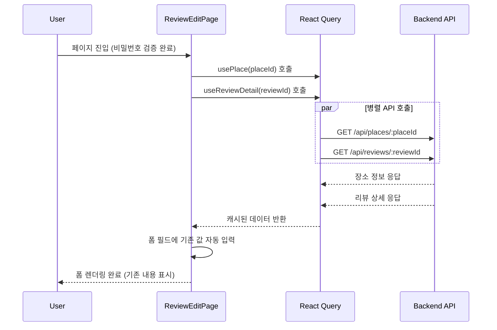
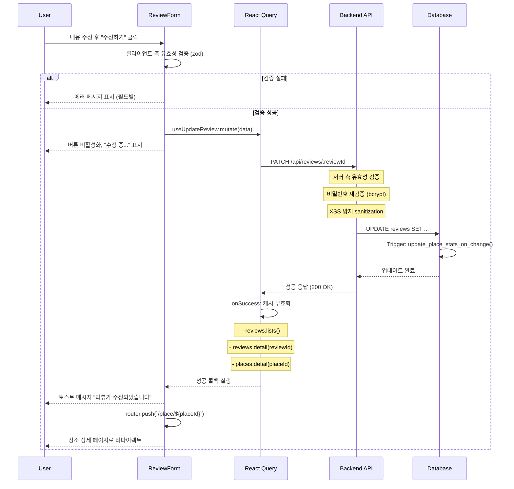
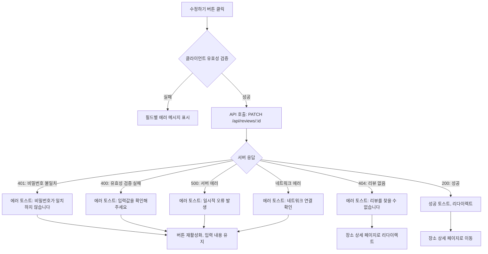

# 리뷰 수정 페이지 구현 계획

## 문서 정보

- **버전**: 1.0.0
- **최종 수정일**: 2025-10-22
- **작성자**: Development Team
- **문서 상태**: Draft
- **페이지 경로**: `/place/[placeId]/review/[reviewId]/edit`
- **우선순위**: P1 (Should Have)
- **참조 문서**:
  - [PRD - 리뷰 관리 기능](/docs/prd.md#323-리뷰-관리)
  - [사용자 플로우 - 리뷰 수정](/docs/userflow.md#42-리뷰-수정)
  - [유스케이스 - UC-003: 리뷰 수정](/docs/usecases/review-management.md#uc-003-리뷰-수정)
  - [상태 관리 설계 - 리뷰 관리](/docs/pages/2-review-management/state.md)
  - [공통 모듈](/docs/common-modules.md)
  - [데이터베이스 설계](/docs/database.md)

---

## 개요

### 페이지 목적

리뷰 수정 페이지는 사용자가 이전에 작성한 리뷰의 내용을 변경할 수 있는 기능을 제공합니다. 비밀번호 인증을 통해 리뷰 작성자임을 확인한 후, 기존 리뷰 내용이 자동으로 입력된 폼을 제공하여 손쉽게 수정할 수 있도록 합니다.

### 주요 기능

1. **기존 리뷰 자동 입력**: 수정 페이지 진입 시 기존 리뷰 데이터를 폼에 자동으로 채움
2. **비밀번호 재확인**: 수정 제출 시 비밀번호를 다시 입력받아 서버에서 검증
3. **동일한 유효성 검증**: 리뷰 작성과 동일한 검증 규칙 적용
4. **변경사항 감지**: 수정된 내용이 없으면 API 호출을 스킵
5. **평점 변경 반영**: 평점이 변경되면 장소의 평균 평점 자동 재계산

### 진입 조건

- 장소 상세 페이지에서 특정 리뷰의 "수정" 버튼 클릭
- 비밀번호 확인 모달에서 비밀번호 검증 성공
- 리뷰 ID와 장소 ID가 유효해야 함

---

## 1. 페이지 구조

### 1.1 라우트 정의

```
/place/[placeId]/review/[reviewId]/edit
```

**동적 세그먼트**:
- `[placeId]`: 장소 고유 ID (UUID)
- `[reviewId]`: 리뷰 고유 ID (UUID)

**파일 경로**:
```
src/app/place/[placeId]/review/[reviewId]/edit/page.tsx
```

### 1.2 레이아웃 구조

```
┌─────────────────────────────────────┐
│ ← 뒤로가기 | 리뷰 수정               │  ← Header (고정)
├─────────────────────────────────────┤
│ [장소명 요약 카드]                   │  ← PlaceHeaderCard (고정)
│  - 장소명                            │
│  - 주소                              │
├─────────────────────────────────────┤
│                                     │
│  작성자명 [홍길동      ]             │  ← 필수, 기존 값 입력됨
│                                     │
│  평점      ★★★★☆                  │  ← 필수, 기존 값 선택됨
│                                     │
│  리뷰 내용                           │  ← 필수, 기존 값 입력됨
│  ┌───────────────────────────────┐ │
│  │ 정말 맛있었어요! ...           │ │
│  │                               │ │
│  └───────────────────────────────┘ │
│  10자 이상 입력해주세요  234/500    │
│                                     │
│  방문 날짜 [2025-10-15  ]           │  ← 선택, 기존 값 입력됨
│                                     │
│  비밀번호 [••••••••   ]             │  ← 필수, 재입력
│  (수정 시 입력한 비밀번호 확인용)     │
│                                     │
│  [       수정하기        ]          │  ← 제출 버튼
│                                     │
└─────────────────────────────────────┘
```

### 1.3 컴포넌트 계층 구조

```
ReviewEditPage (Client Component)
  └─ ReviewManagementProvider
      ├─ PageHeader
      │   ├─ BackButton (← 뒤로가기)
      │   └─ Title ("리뷰 수정")
      ├─ PlaceHeaderCard (장소 정보 요약)
      │   ├─ PlaceName
      │   ├─ PlaceAddress
      │   └─ PlaceCategory
      └─ ReviewForm (mode="edit")
          ├─ FormField: authorName (작성자명)
          ├─ FormField: rating (별점)
          │   └─ StarRating (공통 컴포넌트)
          ├─ FormField: content (리뷰 내용)
          │   └─ Textarea
          ├─ FormField: visitedAt (방문 날짜, 선택)
          │   └─ DatePicker
          ├─ FormField: password (비밀번호)
          │   └─ PasswordInput
          └─ SubmitButton ("수정하기")
```

---

## 2. 데이터 흐름

### 2.1 페이지 진입 시 데이터 로딩



### 2.2 리뷰 수정 제출 플로우



### 2.3 에러 처리 플로우



---

## 3. 상태 관리

### 3.1 서버 상태 (React Query)

#### usePlace (장소 정보 조회)

**목적**: 페이지 상단에 장소 요약 정보 표시

**Query Key**: `['places', 'detail', placeId]`

**구현 위치**: `src/features/place/hooks/usePlace.ts` (기존 존재)

**사용 예시**:
```typescript
const { data: place, isLoading, isError } = usePlace(placeId);
```

**캐싱 전략**:
- staleTime: 5분
- 장소 정보는 자주 변경되지 않으므로 긴 캐싱 시간 사용

#### useReviewDetail (리뷰 상세 조회)

**목적**: 기존 리뷰 데이터를 조회하여 폼에 자동 입력

**Query Key**: `['reviews', 'detail', reviewId]`

**구현 위치**: `src/features/review/hooks/useReviewDetail.ts` (상태관리 설계에서 정의됨)

**API 엔드포인트**: `GET /api/reviews/:reviewId`

**사용 예시**:
```typescript
const { data: review, isLoading, isError } = useReviewDetail(reviewId);
```

**응답 타입**:
```typescript
interface Review {
  id: string;
  placeId: string;
  authorName: string;
  rating: number; // 1-5
  content: string;
  visitedAt: string | null; // ISO 8601 date
  createdAt: string; // ISO 8601 datetime
  updatedAt: string;
}
```

**캐싱 전략**:
- staleTime: 5분
- enabled: `!!reviewId` (reviewId가 있을 때만 실행)

#### useUpdateReview (리뷰 수정 뮤테이션)

**목적**: 수정된 리뷰 데이터를 서버에 전송

**구현 위치**: `src/features/review/hooks/useUpdateReview.ts` (상태관리 설계에서 정의됨)

**API 엔드포인트**: `PATCH /api/reviews/:reviewId`

**요청 본문**:
```typescript
interface ReviewUpdateFormData {
  rating: number;
  content: string;
  visitedAt?: string | null;
  password: string;
}
```

**사용 예시**:
```typescript
const updateReview = useUpdateReview(reviewId, placeId);

// 제출 시
updateReview.mutate(formData);
```

**onSuccess 동작**:
1. 리뷰 목록 캐시 무효화: `queryKeys.reviews.lists()`
2. 리뷰 상세 캐시 무효화: `queryKeys.reviews.detail(reviewId)`
3. 장소 정보 캐시 무효화: `queryKeys.places.detail(placeId)` (평점 변경 시)
4. 성공 토스트 메시지 표시
5. 장소 상세 페이지로 리다이렉트

**onError 동작**:
1. 에러 토스트 메시지 표시
2. 버튼 재활성화
3. 입력 내용 유지 (사용자 재시도 가능)

### 3.2 클라이언트 상태 (react-hook-form)

#### 폼 필드 정의

**스키마**: `reviewUpdateSchema` (zod)

**구현 위치**: `src/schemas/review.ts` (공통 모듈에서 정의됨)

**필드 목록**:

| 필드명 | 타입 | 검증 규칙 | 기본값 (기존 리뷰 데이터) |
|--------|------|----------|-------------------------|
| `authorName` | string | 2-10자 | `review.authorName` |
| `rating` | number | 1-5 (정수) | `review.rating` |
| `content` | string | 10-500자 | `review.content` |
| `visitedAt` | string \| undefined | 유효한 날짜 (선택) | `review.visitedAt` |
| `password` | string | 4-20자 | '' (빈 문자열, 재입력 필요) |

**폼 초기화**:
```typescript
const {
  register,
  handleSubmit,
  watch,
  setValue,
  formState: { errors, isSubmitting, isDirty },
  reset,
} = useForm<ReviewUpdateInput>({
  resolver: zodResolver(reviewUpdateSchema),
  defaultValues: {
    authorName: review?.authorName || '',
    rating: review?.rating || 0,
    content: review?.content || '',
    visitedAt: review?.visitedAt || undefined,
    password: '', // 비밀번호는 항상 재입력
  },
});
```

**주의사항**:
- `review` 데이터가 로딩되기 전에는 빈 값으로 초기화
- `review` 데이터 로딩 완료 후 `reset(defaultValues)` 호출하여 폼 재초기화

#### 변경사항 감지

**isDirty 플래그 활용**:
- `formState.isDirty`: 폼 필드 중 하나라도 변경되었는지 여부
- 변경사항이 없으면 제출 시 토스트 메시지: "수정된 내용이 없습니다"
- API 호출 스킵하여 불필요한 서버 부하 방지

**구현 예시**:
```typescript
const onSubmit = (data: ReviewUpdateInput) => {
  if (!isDirty) {
    toast.info('수정된 내용이 없습니다');
    return;
  }

  updateReview.mutate(data);
};
```

### 3.3 UI 상태

#### 로딩 상태

| 상태 | 조건 | 표시 방법 |
|------|------|----------|
| 초기 로딩 | `isLoading` (place 또는 review) | 전체 페이지 스켈레톤 UI |
| 제출 중 | `updateReview.isPending` 또는 `isSubmitting` | 버튼 비활성화, "수정 중..." 텍스트 |

#### 에러 상태

| 에러 종류 | 표시 방법 |
|----------|----------|
| 장소 조회 실패 | 에러 페이지: "장소를 찾을 수 없습니다" + 홈 버튼 |
| 리뷰 조회 실패 | 에러 페이지: "리뷰를 찾을 수 없습니다" + 뒤로가기 버튼 |
| 폼 유효성 검증 실패 | 필드별 에러 메시지 (빨간색 텍스트) |
| 비밀번호 불일치 | 에러 토스트 + 비밀번호 필드 강조 |
| 네트워크 에러 | 에러 토스트: "네트워크 연결을 확인해주세요" |
| 서버 에러 (5xx) | 에러 토스트: "일시적인 오류가 발생했습니다" |

---

## 4. 백엔드 API

### 4.1 리뷰 상세 조회 API

**엔드포인트**: `GET /api/reviews/:reviewId`

**구현 위치**: `src/features/review/backend/route.ts`

**요청**:
- 경로 파라미터: `reviewId` (UUID)

**응답** (성공 시):
```typescript
{
  success: true,
  data: {
    id: string;
    placeId: string;
    authorName: string;
    rating: number;
    content: string;
    visitedAt: string | null;
    createdAt: string;
    updatedAt: string;
  }
}
```

**응답** (실패 시):
```typescript
{
  success: false,
  error: {
    code: "REVIEW_NOT_FOUND",
    message: "리뷰를 찾을 수 없습니다"
  }
}
```

**비즈니스 로직**:
1. `reviewId`로 리뷰 조회
2. 리뷰가 없으면 404 에러 반환
3. 리뷰가 있으면 `password_hash` 필드를 제외한 모든 정보 반환

**서비스 레이어** (`src/features/review/backend/service.ts`):
```typescript
export async function getReviewById(
  supabase: SupabaseClient,
  reviewId: string
): Promise<Review | null> {
  const { data, error } = await supabase
    .from('reviews')
    .select('id, place_id, author_name, rating, content, visited_at, created_at, updated_at')
    .eq('id', reviewId)
    .single();

  if (error) {
    console.error('Error fetching review:', error);
    return null;
  }

  return data ? mapReviewFromDB(data) : null;
}
```

### 4.2 리뷰 수정 API

**엔드포인트**: `PATCH /api/reviews/:reviewId`

**구현 위치**: `src/features/review/backend/route.ts`

**요청**:
- 경로 파라미터: `reviewId` (UUID)
- 요청 본문:
```typescript
{
  rating: number;      // 1-5
  content: string;     // 10-500자
  visitedAt?: string | null;  // ISO 8601 date (선택)
  password: string;    // 4-20자
}
```

**응답** (성공 시):
```typescript
{
  success: true,
  data: {
    id: string;
    placeId: string;
    authorName: string;
    rating: number;
    content: string;
    visitedAt: string | null;
    createdAt: string;
    updatedAt: string;
  }
}
```

**응답** (실패 시):
```typescript
// 비밀번호 불일치
{
  success: false,
  error: {
    code: "REVIEW_UNAUTHORIZED",
    message: "비밀번호가 일치하지 않습니다"
  }
}

// 리뷰 없음
{
  success: false,
  error: {
    code: "REVIEW_NOT_FOUND",
    message: "리뷰를 찾을 수 없습니다"
  }
}

// 유효성 검증 실패
{
  success: false,
  error: {
    code: "VALIDATION_ERROR",
    message: "입력값을 확인해주세요"
  }
}
```

**비즈니스 로직**:
1. 요청 본문을 `reviewUpdateSchema`로 검증
2. `reviewId`로 리뷰 조회
3. 리뷰가 없으면 404 에러 반환
4. `bcrypt.compare(password, review.password_hash)`로 비밀번호 검증
5. 비밀번호 불일치 시 401 에러 반환
6. XSS 방지를 위해 `content` 필드 sanitize 처리
7. 데이터베이스에서 리뷰 업데이트 (`updated_at`은 트리거로 자동 갱신)
8. 평점 변경 시 `update_place_stats_on_change()` 트리거가 자동으로 평균 평점 재계산
9. 업데이트된 리뷰 반환

**서비스 레이어** (`src/features/review/backend/service.ts`):
```typescript
export async function updateReview(
  supabase: SupabaseClient,
  reviewId: string,
  data: ReviewUpdateFormData
): Promise<Result<Review>> {
  // 1. 기존 리뷰 조회 (비밀번호 해시 포함)
  const { data: existingReview, error: fetchError } = await supabase
    .from('reviews')
    .select('*')
    .eq('id', reviewId)
    .single();

  if (fetchError || !existingReview) {
    return failure('REVIEW_NOT_FOUND', '리뷰를 찾을 수 없습니다');
  }

  // 2. 비밀번호 검증
  const isPasswordValid = await bcrypt.compare(
    data.password,
    existingReview.password_hash
  );

  if (!isPasswordValid) {
    return failure('REVIEW_UNAUTHORIZED', '비밀번호가 일치하지 않습니다');
  }

  // 3. XSS 방지 sanitization
  const sanitizedContent = DOMPurify.sanitize(data.content);

  // 4. 리뷰 업데이트
  const { data: updatedReview, error: updateError } = await supabase
    .from('reviews')
    .update({
      rating: data.rating,
      content: sanitizedContent,
      visited_at: data.visitedAt || null,
      // updated_at은 트리거로 자동 갱신
    })
    .eq('id', reviewId)
    .select('id, place_id, author_name, rating, content, visited_at, created_at, updated_at')
    .single();

  if (updateError || !updatedReview) {
    console.error('Error updating review:', updateError);
    return failure('SERVER_ERROR', '리뷰 수정에 실패했습니다');
  }

  // 5. 평균 평점은 데이터베이스 트리거가 자동으로 재계산
  // update_place_stats_on_change() 트리거 실행됨

  return success(mapReviewFromDB(updatedReview));
}
```

**에러 코드 정의** (`src/features/review/backend/error.ts`):
```typescript
export const REVIEW_ERROR_CODES = {
  REVIEW_NOT_FOUND: 'REVIEW_002',
  REVIEW_UNAUTHORIZED: 'REVIEW_001',
  VALIDATION_ERROR: 'VALIDATION_ERROR',
  SERVER_ERROR: 'SERVER_ERROR',
} as const;
```

---

## 5. 프론트엔드 컴포넌트

### 5.1 페이지 컴포넌트

**파일 경로**: `src/app/place/[placeId]/review/[reviewId]/edit/page.tsx`

**책임**:
- 동적 라우트 파라미터 추출 (`placeId`, `reviewId`)
- 장소 정보 및 리뷰 상세 데이터 로딩
- ReviewForm 컴포넌트에 필요한 데이터 전달
- 로딩 및 에러 상태 처리

**구현 예시**:
```typescript
'use client';

import { use } from 'react';
import { useRouter } from 'next/navigation';
import { ReviewManagementProvider } from '@/features/review/context/ReviewManagementContext';
import { usePlace } from '@/features/place/hooks/usePlace';
import { useReviewDetail } from '@/features/review/hooks/useReviewDetail';
import { PageHeader } from '@/components/layout/PageHeader';
import { PlaceHeaderCard } from '@/features/place/components/PlaceHeaderCard';
import { ReviewForm } from '@/features/review/components/ReviewForm';
import { Skeleton } from '@/components/common/Skeleton';
import { EmptyState } from '@/components/common/EmptyState';
import { AlertCircle } from 'lucide-react';
import { Button } from '@/components/ui/button';

interface ReviewEditPageProps {
  params: Promise<{
    placeId: string;
    reviewId: string;
  }>;
}

export default function ReviewEditPage({ params }: ReviewEditPageProps) {
  const router = useRouter();
  const { placeId, reviewId } = use(params);

  // 데이터 로딩
  const {
    data: place,
    isLoading: isPlaceLoading,
    isError: isPlaceError,
  } = usePlace(placeId);

  const {
    data: review,
    isLoading: isReviewLoading,
    isError: isReviewError,
  } = useReviewDetail(reviewId);

  // 로딩 상태
  if (isPlaceLoading || isReviewLoading) {
    return (
      <div className="min-h-screen bg-gray-50">
        <div className="container max-w-2xl mx-auto p-4">
          <Skeleton className="h-14 mb-4" />
          <Skeleton className="h-32 mb-6" />
          <div className="space-y-4">
            <Skeleton className="h-20" />
            <Skeleton className="h-20" />
            <Skeleton className="h-32" />
            <Skeleton className="h-20" />
            <Skeleton className="h-12" />
          </div>
        </div>
      </div>
    );
  }

  // 에러 상태 - 장소 없음
  if (isPlaceError || !place) {
    return (
      <div className="min-h-screen bg-gray-50 flex items-center justify-center p-4">
        <EmptyState
          icon={AlertCircle}
          title="장소를 찾을 수 없습니다"
          description="요청하신 장소가 존재하지 않거나 삭제되었습니다."
          action={
            <Button onClick={() => router.push('/')}>홈으로 돌아가기</Button>
          }
        />
      </div>
    );
  }

  // 에러 상태 - 리뷰 없음
  if (isReviewError || !review) {
    return (
      <div className="min-h-screen bg-gray-50 flex items-center justify-center p-4">
        <EmptyState
          icon={AlertCircle}
          title="리뷰를 찾을 수 없습니다"
          description="요청하신 리뷰가 존재하지 않거나 이미 삭제되었습니다."
          action={
            <Button onClick={() => router.push(`/place/${placeId}`)}>
              장소 페이지로 돌아가기
            </Button>
          }
        />
      </div>
    );
  }

  return (
    <ReviewManagementProvider>
      <div className="min-h-screen bg-gray-50">
        <div className="container max-w-2xl mx-auto p-4">
          {/* 페이지 헤더 */}
          <PageHeader
            title="리뷰 수정"
            onBack={() => router.push(`/place/${placeId}`)}
          />

          {/* 장소 정보 요약 카드 */}
          <PlaceHeaderCard place={place} className="mb-6" />

          {/* 리뷰 수정 폼 */}
          <ReviewForm
            mode="edit"
            placeId={placeId}
            reviewId={reviewId}
            defaultValues={{
              authorName: review.authorName,
              rating: review.rating,
              content: review.content,
              visitedAt: review.visitedAt || undefined,
              password: '', // 비밀번호는 재입력 필요
            }}
          />
        </div>
      </div>
    </ReviewManagementProvider>
  );
}
```

### 5.2 ReviewForm 컴포넌트 (수정 모드)

**파일 경로**: `src/features/review/components/ReviewForm.tsx`

**책임**:
- 리뷰 작성과 수정 모드를 모두 지원하는 재사용 가능한 폼 컴포넌트
- react-hook-form을 사용한 폼 상태 관리
- zod 스키마를 사용한 유효성 검증
- 수정 모드에서는 기존 데이터를 defaultValues로 받아 자동 입력
- 변경사항 감지 (isDirty)
- 제출 시 적절한 뮤테이션 호출 (작성 vs 수정)

**Props 인터페이스**:
```typescript
interface ReviewFormProps {
  mode: 'create' | 'edit';
  placeId: string;
  reviewId?: string; // 수정 모드일 때만 필요
  defaultValues?: Partial<ReviewCreateInput>;
}
```

**구현 전략**:
- `mode` prop으로 작성/수정 모드 구분
- 작성 모드: `useCreateReview(placeId)` 사용
- 수정 모드: `useUpdateReview(reviewId, placeId)` 사용
- 폼 필드는 동일하게 렌더링
- 제출 버튼 텍스트만 변경 ("작성하기" vs "수정하기")

**핵심 로직**:
```typescript
const ReviewForm: React.FC<ReviewFormProps> = ({
  mode,
  placeId,
  reviewId,
  defaultValues,
}) => {
  const createReview = useCreateReview(placeId);
  const updateReview = reviewId
    ? useUpdateReview(reviewId, placeId)
    : null;

  const {
    register,
    handleSubmit,
    watch,
    setValue,
    formState: { errors, isSubmitting, isDirty },
  } = useForm<ReviewCreateInput>({
    resolver: zodResolver(
      mode === 'edit' ? reviewUpdateSchema : reviewCreateSchema
    ),
    defaultValues: defaultValues || {
      authorName: '',
      rating: 0,
      content: '',
      visitedAt: undefined,
      password: '',
    },
  });

  const rating = watch('rating');
  const content = watch('content');

  const onSubmit = (data: ReviewCreateInput) => {
    // 수정 모드에서 변경사항 없으면 스킵
    if (mode === 'edit' && !isDirty) {
      toast.info('수정된 내용이 없습니다');
      return;
    }

    // 적절한 뮤테이션 호출
    if (mode === 'create') {
      createReview.mutate(data);
    } else if (mode === 'edit' && updateReview) {
      updateReview.mutate(data);
    }
  };

  const isPending = mode === 'create'
    ? createReview.isPending
    : updateReview?.isPending ?? false;

  return (
    <form onSubmit={handleSubmit(onSubmit)} className="space-y-6">
      {/* 작성자명 - 수정 모드에서는 비활성화 */}
      <FormField
        label="작성자명"
        required
        error={errors.authorName?.message}
      >
        <input
          type="text"
          {...register('authorName')}
          disabled={mode === 'edit'} // 수정 모드에서는 이름 변경 불가
          className={cn(
            'w-full px-4 py-2 border rounded-lg',
            mode === 'edit' && 'bg-gray-100 cursor-not-allowed',
            errors.authorName && 'border-red-500'
          )}
          placeholder="2-10자 입력"
        />
      </FormField>

      {/* 평점 */}
      <FormField
        label="평점"
        required
        error={errors.rating?.message}
      >
        <StarRating
          rating={rating}
          onRatingChange={(value) => setValue('rating', value, { shouldDirty: true })}
          size="lg"
        />
      </FormField>

      {/* 리뷰 내용 */}
      <FormField
        label="리뷰 내용"
        required
        error={errors.content?.message}
      >
        <textarea
          {...register('content')}
          className={cn(
            'w-full px-4 py-2 border rounded-lg min-h-[120px]',
            errors.content && 'border-red-500'
          )}
          placeholder="10-500자 입력"
        />
        <div className="flex justify-between mt-1">
          <p className="text-sm text-gray-500">최소 10자 이상 입력해주세요</p>
          <p className="text-sm text-gray-500">{content.length}/500</p>
        </div>
      </FormField>

      {/* 방문 날짜 (선택) */}
      <FormField label="방문 날짜 (선택)">
        <input
          type="date"
          {...register('visitedAt')}
          className="w-full px-4 py-2 border rounded-lg"
        />
      </FormField>

      {/* 비밀번호 */}
      <FormField
        label="비밀번호"
        required
        error={errors.password?.message}
      >
        <input
          type="password"
          {...register('password')}
          className={cn(
            'w-full px-4 py-2 border rounded-lg',
            errors.password && 'border-red-500'
          )}
          placeholder={
            mode === 'edit'
              ? '수정 시 입력한 비밀번호 확인용'
              : '4-20자 (수정/삭제 시 사용)'
          }
        />
      </FormField>

      {/* 제출 버튼 */}
      <button
        type="submit"
        disabled={isSubmitting || isPending}
        className={cn(
          'w-full py-3 rounded-lg font-medium transition-colors',
          'bg-primary text-white hover:bg-primary-hover',
          'disabled:opacity-50 disabled:cursor-not-allowed'
        )}
      >
        {isSubmitting || isPending
          ? mode === 'edit'
            ? '수정 중...'
            : '작성 중...'
          : mode === 'edit'
          ? '수정하기'
          : '작성하기'}
      </button>
    </form>
  );
};
```

**주요 차이점 (작성 vs 수정)**:

| 항목 | 작성 모드 | 수정 모드 |
|------|----------|----------|
| 작성자명 필드 | 입력 가능 | 비활성화 (disabled) |
| 폼 초기값 | 모두 빈 값 | 기존 리뷰 데이터 |
| 비밀번호 | 새로 입력 | 재입력 (검증용) |
| 제출 버튼 텍스트 | "작성하기" | "수정하기" |
| 뮤테이션 | `useCreateReview` | `useUpdateReview` |
| 변경사항 확인 | 없음 | `isDirty` 체크 |

### 5.3 PlaceHeaderCard 컴포넌트

**파일 경로**: `src/features/place/components/PlaceHeaderCard.tsx`

**책임**:
- 리뷰 작성/수정 페이지 상단에 장소 정보 요약 표시
- 장소명, 주소, 카테고리를 간결하게 표시
- 재사용 가능한 컴포넌트

**Props 인터페이스**:
```typescript
interface PlaceHeaderCardProps {
  place: Place;
  className?: string;
}
```

**구현 예시**:
```typescript
'use client';

import { getCategoryIcon } from '@/lib/utils/category';
import type { Place } from '@/types/place';
import { cn } from '@/lib/utils';

export function PlaceHeaderCard({ place, className }: PlaceHeaderCardProps) {
  const categoryIcon = getCategoryIcon(place.category);

  return (
    <div
      className={cn(
        'bg-white border rounded-lg p-4 shadow-sm',
        className
      )}
    >
      <div className="flex items-start gap-3">
        {/* 카테고리 아이콘 */}
        <div className="text-3xl flex-shrink-0" aria-hidden="true">
          {categoryIcon}
        </div>

        {/* 장소 정보 */}
        <div className="flex-1 min-w-0">
          <h2 className="text-lg font-semibold text-gray-900 truncate">
            {place.name}
          </h2>
          <p className="text-sm text-gray-600 truncate">{place.address}</p>
          <p className="text-xs text-gray-500 mt-1">{place.category}</p>
        </div>
      </div>
    </div>
  );
}
```

### 5.4 PageHeader 컴포넌트

**파일 경로**: `src/components/layout/PageHeader.tsx`

**책임**:
- 페이지 상단의 공통 헤더 UI
- 뒤로가기 버튼과 페이지 제목 표시
- 재사용 가능한 레이아웃 컴포넌트

**Props 인터페이스**:
```typescript
interface PageHeaderProps {
  title: string;
  onBack?: () => void;
  className?: string;
}
```

**구현 예시**:
```typescript
'use client';

import { ArrowLeft } from 'lucide-react';
import { cn } from '@/lib/utils';

export function PageHeader({ title, onBack, className }: PageHeaderProps) {
  return (
    <header
      className={cn(
        'flex items-center gap-3 py-4 mb-4 border-b bg-white',
        className
      )}
    >
      {onBack && (
        <button
          onClick={onBack}
          className="p-2 hover:bg-gray-100 rounded-lg transition-colors"
          aria-label="뒤로가기"
        >
          <ArrowLeft className="w-5 h-5 text-gray-700" />
        </button>
      )}
      <h1 className="text-xl font-semibold text-gray-900">{title}</h1>
    </header>
  );
}
```

---

## 6. 구현 단계

### Phase 1: 백엔드 API 구현 (우선순위: 높음)

**작업 목록**:

1. **리뷰 상세 조회 API** (`GET /api/reviews/:reviewId`)
   - 서비스 함수: `getReviewById()`
   - 라우트 핸들러 추가
   - 에러 처리: 리뷰 없음 (404)

2. **리뷰 수정 API** (`PATCH /api/reviews/:reviewId`)
   - 서비스 함수: `updateReview()`
   - 비밀번호 검증 로직 (bcrypt)
   - XSS 방지 sanitization
   - 라우트 핸들러 추가
   - 에러 처리: 비밀번호 불일치 (401), 리뷰 없음 (404), 유효성 검증 실패 (400)

**구현 파일**:
- `src/features/review/backend/route.ts` (라우트 정의)
- `src/features/review/backend/service.ts` (비즈니스 로직)
- `src/features/review/backend/schema.ts` (요청/응답 스키마)
- `src/features/review/backend/error.ts` (에러 코드 정의)

**검증 방법**:
- Postman 또는 cURL로 API 테스트
- 비밀번호 일치/불일치 케이스 테스트
- 리뷰 없음 케이스 테스트
- 유효성 검증 실패 케이스 테스트

### Phase 2: React Query 훅 구현 (우선순위: 높음)

**작업 목록**:

1. **useReviewDetail 훅**
   - 리뷰 상세 조회 쿼리
   - 캐싱 전략 설정 (staleTime: 5분)
   - 에러 처리

2. **useUpdateReview 훅**
   - 리뷰 수정 뮤테이션
   - onSuccess: 캐시 무효화, 토스트, 리다이렉트
   - onError: 에러 토스트
   - 타입 정의

**구현 파일**:
- `src/features/review/hooks/useReviewDetail.ts`
- `src/features/review/hooks/useUpdateReview.ts`

**검증 방법**:
- React Query DevTools로 쿼리 상태 확인
- 뮤테이션 성공/실패 시 캐시 무효화 확인

### Phase 3: 공통 컴포넌트 구현 (우선순위: 중간)

**작업 목록**:

1. **PageHeader 컴포넌트**
   - 뒤로가기 버튼 + 제목
   - 재사용 가능한 레이아웃 컴포넌트

2. **PlaceHeaderCard 컴포넌트**
   - 장소 정보 요약 카드
   - 카테고리 아이콘 표시

**구현 파일**:
- `src/components/layout/PageHeader.tsx`
- `src/features/place/components/PlaceHeaderCard.tsx`

**검증 방법**:
- Storybook에서 독립적으로 테스트 (선택사항)
- 다양한 props 조합 테스트

### Phase 4: ReviewForm 컴포넌트 수정 모드 지원 (우선순위: 높음)

**작업 목록**:

1. **ReviewForm 컴포넌트 확장**
   - `mode` prop 추가 ('create' | 'edit')
   - `reviewId` prop 추가 (수정 모드용)
   - `defaultValues` prop 추가
   - 수정 모드에서 `useUpdateReview` 훅 사용
   - 작성자명 필드 비활성화 로직 추가
   - `isDirty` 체크 로직 추가
   - 제출 버튼 텍스트 동적 변경

**구현 파일**:
- `src/features/review/components/ReviewForm.tsx` (기존 파일 수정)

**검증 방법**:
- 리뷰 작성 페이지에서 기존 동작 유지 확인
- 리뷰 수정 페이지에서 새 동작 확인
- 변경사항 없을 때 토스트 메시지 확인

### Phase 5: 페이지 컴포넌트 구현 (우선순위: 높음)

**작업 목록**:

1. **ReviewEditPage 컴포넌트**
   - 동적 라우트 파라미터 추출
   - `usePlace`, `useReviewDetail` 훅 사용
   - 로딩 상태 처리 (스켈레톤 UI)
   - 에러 상태 처리 (EmptyState)
   - ReviewForm 컴포넌트에 데이터 전달

**구현 파일**:
- `src/app/place/[placeId]/review/[reviewId]/edit/page.tsx`

**검증 방법**:
- 장소 상세 페이지에서 수정 버튼 클릭 후 진입 확인
- 비밀번호 검증 후 페이지 로딩 확인
- 기존 리뷰 데이터가 폼에 자동 입력되는지 확인
- 로딩 및 에러 상태 확인

### Phase 6: 통합 테스트 및 버그 수정 (우선순위: 중간)

**작업 목록**:

1. **엔드투엔드 플로우 테스트**
   - 장소 상세 페이지 → 수정 버튼 → 비밀번호 모달 → 수정 페이지 → 제출 → 리다이렉트
   - 비밀번호 불일치 케이스
   - 변경사항 없음 케이스
   - 유효성 검증 실패 케이스
   - 네트워크 에러 케이스

2. **UI/UX 개선**
   - 로딩 상태 개선
   - 에러 메시지 개선
   - 토스트 메시지 타이밍 조정
   - 폼 필드 포커스 관리

3. **접근성 개선**
   - 키보드 네비게이션 테스트
   - 스크린 리더 테스트
   - ARIA 속성 추가

**검증 방법**:
- 수동 테스트 (다양한 시나리오)
- Lighthouse 접근성 점수 확인 (>90)
- 크로스 브라우저 테스트

---

## 7. 예외 상황 처리

### 7.1 장소 조회 실패

**상황**: `placeId`가 유효하지 않거나 장소가 삭제됨

**처리 방법**:
- EmptyState 컴포넌트 표시
- 제목: "장소를 찾을 수 없습니다"
- 설명: "요청하신 장소가 존재하지 않거나 삭제되었습니다."
- 액션: "홈으로 돌아가기" 버튼 → `/` 이동

### 7.2 리뷰 조회 실패

**상황**: `reviewId`가 유효하지 않거나 리뷰가 삭제됨

**처리 방법**:
- EmptyState 컴포넌트 표시
- 제목: "리뷰를 찾을 수 없습니다"
- 설명: "요청하신 리뷰가 존재하지 않거나 이미 삭제되었습니다."
- 액션: "장소 페이지로 돌아가기" 버튼 → `/place/${placeId}` 이동

### 7.3 비밀번호 불일치

**상황**: 리뷰 수정 제출 시 서버에서 비밀번호 검증 실패

**처리 방법**:
- 에러 토스트 메시지: "비밀번호가 일치하지 않습니다"
- 비밀번호 필드에 빨간색 테두리 표시
- 비밀번호 필드에 포커스 이동
- 입력 내용은 유지 (재시도 가능)

### 7.4 변경사항 없음

**상황**: 사용자가 아무 내용도 수정하지 않고 제출

**처리 방법**:
- `formState.isDirty` 플래그 체크
- 토스트 메시지: "수정된 내용이 없습니다" (info 타입)
- API 호출 스킵
- 페이지 유지 (리다이렉트 없음)

### 7.5 유효성 검증 실패

**상황**: 필수 필드 누락 또는 형식 오류

**처리 방법**:
- 필드별 에러 메시지 표시 (빨간색 텍스트)
- 첫 번째 에러 필드로 스크롤
- 해당 필드에 포커스 이동
- 제출 버튼 비활성화 유지

### 7.6 네트워크 에러

**상황**: API 호출 중 네트워크 연결 끊김

**처리 방법**:
- 에러 토스트 메시지: "네트워크 연결을 확인해주세요"
- 버튼 재활성화
- 입력 내용 유지
- 재시도 가능

### 7.7 서버 에러 (5xx)

**상황**: 서버에서 예기치 않은 오류 발생

**처리 방법**:
- 에러 토스트 메시지: "일시적인 오류가 발생했습니다. 잠시 후 다시 시도해주세요"
- 버튼 재활성화
- 입력 내용 유지
- 콘솔에 에러 로깅

---

## 8. 성능 최적화

### 8.1 데이터 로딩 최적화

**병렬 데이터 패칭**:
- `usePlace`와 `useReviewDetail`을 동시에 호출
- React Query가 자동으로 병렬 요청 처리
- 두 요청이 모두 완료될 때까지 로딩 상태 유지

**캐싱 활용**:
- 장소 정보는 이미 캐시에 있을 가능성 높음 (장소 상세 페이지에서 진입)
- React Query의 staleTime 설정으로 불필요한 재요청 방지
- staleTime: 5분 (장소 정보와 리뷰 정보 모두)

### 8.2 폼 최적화

**uncontrolled 컴포넌트**:
- react-hook-form은 uncontrolled 방식 사용
- 입력 시마다 리렌더링 발생하지 않음
- `watch()` 사용 시에만 해당 필드 리렌더링

**유효성 검증 전략**:
- 실시간 검증은 `blur` 이벤트에서만 실행
- `onChange` 검증은 사용하지 않음 (성능 저하 방지)
- 제출 시 최종 검증 수행

### 8.3 번들 크기 최적화

**Code Splitting**:
- 페이지 단위로 자동 코드 스플릿 (Next.js App Router)
- DOMPurify 라이브러리는 서버에서만 사용 (클라이언트 번들에 포함 안 됨)

**Tree Shaking**:
- 사용하지 않는 유틸리티 함수는 번들에 포함되지 않음
- lodash 대신 es-toolkit 사용 (더 작은 번들 크기)

---

## 9. 보안 고려사항

### 9.1 비밀번호 관리

**클라이언트**:
- 평문으로 서버에 전송 (HTTPS 필수)
- `type="password"` 사용하여 입력 마스킹
- 브라우저 자동완성 지원 (autocomplete="current-password")

**서버**:
- bcrypt.compare()로 해시 비교
- salt rounds: 10
- 비밀번호 해시는 절대 클라이언트에 노출 안 됨

### 9.2 입력값 검증

**클라이언트 측**:
- zod 스키마로 타입 안전성 보장
- react-hook-form으로 실시간 검증

**서버 측**:
- 동일한 zod 스키마 재사용
- DOMPurify로 XSS 공격 방지 (content 필드)
- Supabase 파라미터화된 쿼리로 SQL Injection 방지

### 9.3 권한 확인

**비밀번호 재검증**:
- 비밀번호 확인 모달에서 1차 검증
- 리뷰 수정 API에서 2차 검증 (이중 보안)
- 클라이언트 측 검증은 우회 가능하므로 서버 측 검증 필수

---

## 10. 접근성 (Accessibility)

### 10.1 키보드 네비게이션

**지원 기능**:
- Tab 키로 모든 폼 필드 순회 가능
- Enter 키로 폼 제출 가능
- Escape 키로 모달 닫기 (비밀번호 확인 모달)

**포커스 관리**:
- 페이지 진입 시 첫 번째 입력 필드(작성자명)에 자동 포커스
- 에러 발생 시 첫 번째 에러 필드로 포커스 이동
- 포커스 스타일 명확하게 표시 (2px 파란색 외곽선)

### 10.2 스크린 리더 지원

**ARIA 속성**:
- 모든 입력 필드에 `<label>` 연결
- 필수 필드에 `aria-required="true"` 추가
- 에러 메시지에 `aria-live="polite"` 적용
- 별점 컴포넌트에 `aria-label="5점 만점에 N점"` 추가

**시맨틱 HTML**:
- `<form>` 요소 사용
- `<button type="submit">` 사용
- `<fieldset>`과 `<legend>` 활용 (그룹화가 필요한 경우)

### 10.3 색상 대비

**WCAG AA 기준 준수**:
- 텍스트와 배경의 명암 대비 4.5:1 이상
- 에러 메시지는 빨간색 + 아이콘으로 이중 표시 (색맹 사용자 고려)
- 비활성화된 버튼도 충분한 대비 유지

---

## 11. 테스트 시나리오

### 11.1 정상 플로우

1. 장소 상세 페이지에서 특정 리뷰의 "수정" 버튼 클릭
2. 비밀번호 확인 모달에서 비밀번호 입력 및 확인
3. 비밀번호 검증 성공, 리뷰 수정 페이지로 진입
4. 기존 리뷰 내용이 폼에 자동으로 입력된 상태 확인
5. 리뷰 내용 수정 (예: 평점 5 → 4, 내용 일부 수정)
6. 비밀번호 재입력
7. "수정하기" 버튼 클릭
8. 성공 토스트 메시지 확인: "리뷰가 수정되었습니다"
9. 장소 상세 페이지로 리다이렉트
10. 수정된 리뷰가 목록에 반영된 것 확인
11. 평균 평점이 재계산된 것 확인 (평점 변경 시)

### 11.2 비밀번호 불일치

1. 정상 플로우 1-5 단계 수행
2. 리뷰 내용 수정
3. **잘못된 비밀번호** 입력
4. "수정하기" 버튼 클릭
5. 에러 토스트 메시지 확인: "비밀번호가 일치하지 않습니다"
6. 비밀번호 필드에 빨간색 테두리 표시 확인
7. 입력 내용이 유지되는지 확인 (다시 입력 필요 없음)
8. 올바른 비밀번호로 재시도 가능 확인

### 11.3 변경사항 없음

1. 정상 플로우 1-5 단계 수행
2. **아무 내용도 수정하지 않음**
3. 비밀번호 입력
4. "수정하기" 버튼 클릭
5. 토스트 메시지 확인: "수정된 내용이 없습니다" (info 타입)
6. API 호출이 발생하지 않는지 확인 (Network 탭)
7. 페이지가 유지되는지 확인 (리다이렉트 없음)

### 11.4 유효성 검증 실패

1. 정상 플로우 1-5 단계 수행
2. 리뷰 내용을 **5자로 변경** (최소 10자 미만)
3. 비밀번호 입력
4. "수정하기" 버튼 클릭
5. 리뷰 내용 필드 하단에 에러 메시지 확인: "리뷰 내용은 최소 10자 이상이어야 합니다"
6. 필드에 빨간색 테두리 표시 확인
7. 버튼이 비활성화된 상태 유지 확인
8. 에러 필드로 스크롤 이동 확인
9. 유효한 내용으로 수정 후 재시도 가능 확인

### 11.5 리뷰 삭제된 경우

1. 리뷰 수정 페이지 URL을 직접 입력하여 진입
2. 해당 리뷰가 이미 다른 사용자에 의해 삭제된 상태
3. EmptyState 컴포넌트 확인
4. 제목: "리뷰를 찾을 수 없습니다"
5. "장소 페이지로 돌아가기" 버튼 클릭
6. 장소 상세 페이지로 이동 확인

### 11.6 네트워크 에러

1. 정상 플로우 1-7 단계 수행
2. 브라우저 개발자 도구에서 네트워크 오프라인 설정
3. "수정하기" 버튼 클릭
4. 에러 토스트 메시지 확인: "네트워크 연결을 확인해주세요"
5. 버튼이 재활성화되는지 확인
6. 입력 내용이 유지되는지 확인
7. 네트워크 다시 연결 후 재시도 가능 확인

---

## 12. 기존 코드베이스와의 통합

### 12.1 공통 모듈 재사용

**이미 구현된 공통 모듈 사용**:
- `StarRating` 컴포넌트 (별점 선택)
- `Skeleton` 컴포넌트 (로딩 상태)
- `EmptyState` 컴포넌트 (에러 상태)
- `formatRelativeTime()` 유틸리티 함수
- `apiPatch()` API 클라이언트 함수
- `reviewUpdateSchema` zod 스키마

**경로 확인**:
- `src/components/common/StarRating.tsx`
- `src/components/common/Skeleton.tsx`
- `src/components/common/EmptyState.tsx`
- `src/lib/utils/date.ts`
- `src/lib/api-client.ts`
- `src/schemas/review.ts`

### 12.2 상태 관리 통합

**ReviewManagementProvider 사용**:
- 리뷰 수정 페이지도 동일한 Context 사용
- 비밀번호 확인 모달 상태 공유
- 삭제 확인 다이얼로그 상태 공유

**주의사항**:
- 리뷰 수정 페이지는 독립적인 페이지이므로 Provider를 페이지 레벨에서 래핑
- 다른 페이지와 상태를 공유하지 않음 (독립적인 Provider 인스턴스)

### 12.3 API 라우트 통합

**기존 라우트 구조**:
```
src/features/review/backend/route.ts
  - POST /places/:placeId/reviews (리뷰 작성)
  - GET /places/:placeId/reviews (리뷰 목록 조회)
  - DELETE /reviews/:id (리뷰 삭제)
```

**추가할 라우트**:
```
  - GET /reviews/:id (리뷰 상세 조회)
  - PATCH /reviews/:id (리뷰 수정)
```

**주의사항**:
- 기존 라우트 핸들러와 동일한 파일에 추가
- 동일한 에러 처리 패턴 사용
- 동일한 응답 포맷 사용 (`success`, `failure`)

---

## 13. 배포 전 체크리스트

### 13.1 기능 검증

- [ ] 리뷰 수정 페이지 정상 진입 확인
- [ ] 기존 리뷰 데이터 자동 입력 확인
- [ ] 리뷰 수정 제출 정상 동작 확인
- [ ] 비밀번호 검증 정상 동작 확인
- [ ] 변경사항 없음 감지 확인
- [ ] 유효성 검증 정상 동작 확인
- [ ] 에러 처리 정상 동작 확인
- [ ] 평균 평점 재계산 확인 (평점 변경 시)
- [ ] React Query 캐시 무효화 확인
- [ ] 리다이렉트 정상 동작 확인

### 13.2 성능 검증

- [ ] Lighthouse 성능 점수 > 90
- [ ] 페이지 초기 로딩 < 2초
- [ ] API 응답 시간 < 500ms (p95)
- [ ] React Query DevTools로 캐싱 확인
- [ ] 불필요한 리렌더링 없음 확인

### 13.3 보안 검증

- [ ] 비밀번호 평문 노출 없음 확인
- [ ] XSS 공격 방지 확인 (DOMPurify 적용)
- [ ] SQL Injection 방지 확인 (파라미터화된 쿼리)
- [ ] HTTPS 적용 확인 (프로덕션)
- [ ] 서버 측 유효성 검증 확인
- [ ] 비밀번호 재검증 확인 (이중 보안)

### 13.4 접근성 검증

- [ ] Lighthouse 접근성 점수 > 90
- [ ] 키보드 네비게이션 정상 동작 확인
- [ ] 스크린 리더 테스트 (VoiceOver 또는 NVDA)
- [ ] ARIA 속성 올바르게 적용 확인
- [ ] 색상 대비 WCAG AA 기준 충족 확인
- [ ] 포커스 스타일 명확하게 표시 확인

### 13.5 크로스 브라우저 테스트

- [ ] Chrome (최신 버전)
- [ ] Safari (iOS 포함)
- [ ] Firefox
- [ ] Edge
- [ ] Samsung Internet (모바일)

### 13.6 반응형 디자인 테스트

- [ ] 모바일 (360px ~ 767px)
- [ ] 태블릿 (768px ~ 1023px)
- [ ] 데스크톱 (1024px 이상)

---

## 14. 향후 개선 사항

### 14.1 기능 개선

- **리뷰 이미지 첨부**: 수정 시 이미지도 변경 가능
- **리뷰 버전 히스토리**: 수정 이력 추적
- **자동 저장 (Draft)**: 작성 중인 내용을 로컬 스토리지에 임시 저장
- **변경사항 경고**: 수정 중인 내용이 있을 때 페이지 이탈 시 경고

### 14.2 UX 개선

- **실시간 글자 수 표시**: 입력 중 글자 수 실시간 업데이트
- **미리보기 기능**: 수정 전/후 비교
- **Undo/Redo 기능**: 수정 내용 되돌리기
- **키보드 단축키**: Ctrl+S로 저장 등

### 14.3 성능 개선

- **Optimistic Update**: 수정 시에도 낙관적 업데이트 적용
- **Debouncing**: 실시간 검증 시 디바운싱 적용
- **Virtual Scrolling**: 매우 긴 리뷰 내용에 대한 최적화

---

## 15. 참고 문서

- [PRD - 리뷰 관리 기능](/docs/prd.md#323-리뷰-관리)
- [사용자 플로우 - 리뷰 수정](/docs/userflow.md#42-리뷰-수정)
- [유스케이스 - UC-003: 리뷰 수정](/docs/usecases/review-management.md#uc-003-리뷰-수정)
- [상태 관리 설계 - 리뷰 관리](/docs/pages/2-review-management/state.md)
- [공통 모듈](/docs/common-modules.md)
- [데이터베이스 설계](/docs/database.md)
- [React Query 공식 문서 - Mutations](https://tanstack.com/query/latest/docs/react/guides/mutations)
- [react-hook-form 공식 문서](https://react-hook-form.com/)

---

**문서 끝**
